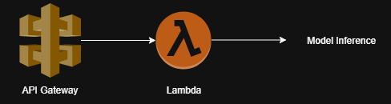
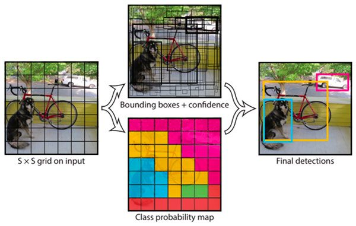
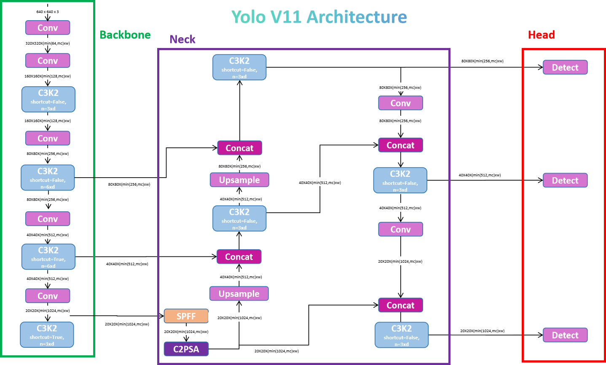
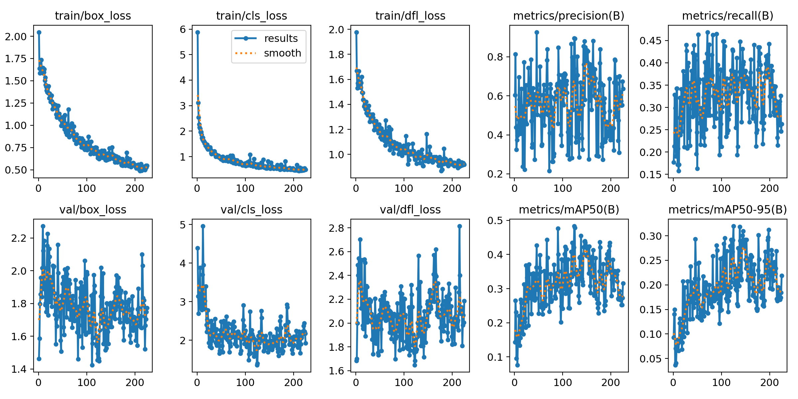

# Automated Anomaly Detection

This folder presents a **deep learning anomaly detection system** that uses **YOLOv11** .  
The model detects and classifies electrical faults and anomalies, and it is deployed as a **serverless AWS Lambda function** with a **public HTTP endpoint**. It provides **real-time inference** capability through a **Lambda + API Gateway** setup, allowing for scalable, on-demand analysis.

---
## Overview

---

## Classes Used

The model was trained on 4 distinct anomaly categories and 1 base category:

| Class ID | Class Name |
|-----------|-------------|
| 0 | Full wire overload |
| 1 | Loose Joint - Faulty |
| 2 | Loose Joint - Potential |
| 3 | Point Overload - Faulty |
| 4 | Normal |

---

## Model Details



The system uses **YOLOv11**, a state-of-the-art object detection architecture, for anomaly localization and classification.  

- Real-time detection with high recall and accuracy  
- End-to-end bounding box and class prediction  
- Efficient inference for cloud or edge deployment  



## Training Configuration

| Parameter | Value |
|------------|--------|
| Framework | Ultralytics |
| Model | YOLOv11 |
| Image Size | 640×640 |
| Batch Size | 16 |
| Optimizer | AdamW |
| Learning Rate | 1e-4 |
| Momentum | 0.9 |
| Scheduler | Cosine Annealing |
| Epochs | 125 (Highest recall) |
| Dataset Split | 70% Train / 20% Validation  / 10% Test |

## Training Results and Evaluation



## Deployment: AWS Lambda + HTTP Endpoint

The trained YOLOv11 model was exported to **ONNX** with opset 17 and deployed as a **serverless Lambda function** behind an **API Gateway endpoint**.  
This allows users or applications to send images to the endpoint and receive predictions in real time.

### Lambda + Endpoint Architecture


#### Inference Flow

1. **Client** sends an image (base64) with threshold value to the API Gateway.  
2. **API Gateway** triggers the Lambda function.  
3. **Lambda** loads the YOLOv11 model and performs inference.  
4. **Response** contains predicted class labels, bounding boxes, and confidence scores.

**Example Endpoint:** 
### Request:
```bash
curl -X POST \
  https://<lambda-endpoint>.amazonaws.com/predict \
  -H "Content-Type: application/json" \
  -d '{
        "image_base64": image_base64,"threshold": 0.7,
      }'
```
#### Dependencies 
1. **ONNX Runtime**  
   - In Lambda, inference depends on the **ONNX Runtime** library to load and run the YOLO model efficiently.  

2. **Python Packages**  
   - Common dependencies include:  
     - `onnxruntime` – for running the model  
     - `numpy` – for tensor manipulation  
     - `Pillow` / `opencv-python` – for image preprocessing   

3. **AWS Services**  
   - **API Gateway**: Exposes Lambda as an HTTP endpoint  
   - **Lambda**: Hosts and executes the model inference   

4. **Frontend Dependencies**  
   - A JavaScript/React web app to upload images and draw bounding boxes  
   - Uses `react-konva` for overlaying bounding boxes  

5. **Networking & Security**  
   - **CORS configuration** in API Gateway to allow the frontend to call the backend  
   - **IAM roles** for Lambda to access other AWS resources (if needed)  

#### Known Limitations
1. Model inference should not exceed 30 seconds since the HTTP request will have a timeout. 
2. AWS Lambda has a maximum of 10 GB memory.
3. Lambda has a max execution time of 15 minutes.
4. Works well for moderate request loads, but at very high volumes, it may hit concurrency limits in Lambda.
 